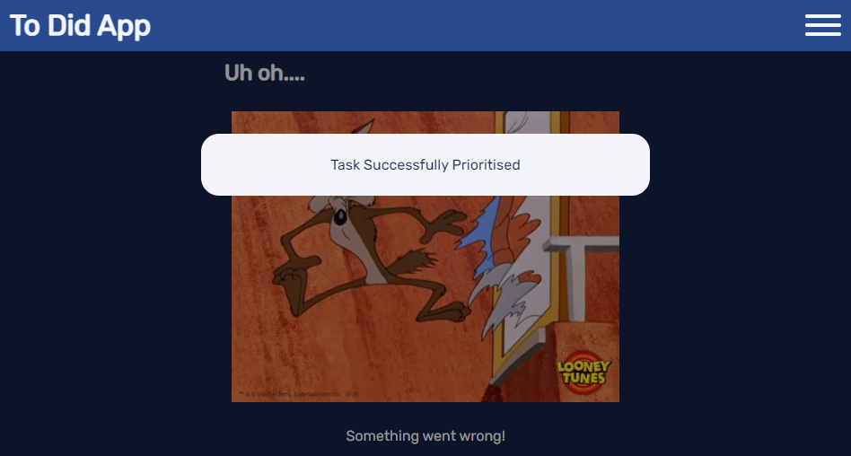

# Testing Doc

I have used cypress to do a suite of integration tests. This has meant that I can re-do the tests after an edit without having to click every link or take every screenshot. Although I have done some manual tests for the sections that i found harder to test.

For information on how to run the cypress tests go [here](#cypress)

## Testing strategy.

There are two types of pages on this site, the 'public' pages which are viewed by users not logged in and the 'user' pages which a log in is required for

| Public       | User            |
| ------------ | --------------- |
| Landing page | Account         |
| Register     | Home            |
| Log In       | Contact         |
| Contact      | Add Task        |
|              | Edit Task       |
|              | Delete Task     |
|              | Prioritize Task |
|              | Complete Task   |
|              | Edit Category   |
|              | Delete Category |
|              | Log Out         |


    1.  Public pages
            Do they all render correctly?
    2.  Create phase
            Create a user, create some tasks and create a category in a task. 
            Can you do it from all the right pages? Do the pages render correctly?
    3.  Edit phase
            Is the edit tasks accessible from all pages and edit categories on the accounts page. 
            Can you complete/prioritise tasks from all the correct pages? Do the pages render correctly?
    4.  Delete Phase
            Can you delete tasks from all pages and delete categories on the accounts page?
    5.  Logging in/out
            Can the user log in out?
    6.  Security / error handling
            Can you get to parts of the site without logging In or with the wrong credentials? 
            what happens if you try to access something that doesn't exist?

        Note: As the delete the user section has not been build yet, 
        the cypress test user has to be manually deleted from the database after running the test suite

## During Testing

The following things where observed during testing 

| Observation | Action | Comment |
| --- | --- | --- |
| When no tasks planned/completed the bar should say something like 'No Tasks Prioritised'| Added to next feature update  |  |
| Boxes should turn red when required sections not filled in | Added to future feature update  |  |
| On large screens the tasks should be split into two lists|  Added to next feature update  | Stopped them rendering oddly, but will split them in to separately rendered columns on the next feature update |
| Contact form - name/email issues|  Bug Fixed  | Stopped the form control inputs being very small |
| Due by date is backwards (2021-10-10)|  Added to next feature update  | Get the page to show the date in nicer format (01-Jan-20) |
| Task name should keep the capitals the user writes (eg Test Task not Test task)|  Added to next feature update  | currently using the .capitalize function, need to change so it takes the first letter and capitalizes it instead |
| Nav bar links are not whole buttons| Bug Fixed | moved a tag to outside |
| The title on the contact page is not bound| Bug Fixed |  |
| Register function doesn't load the Account Page| Bug Fixed | routing error |
| When No tasks are found the text needs some padding| Bug Fixed |  |
| Landing Page on mobile should have a 'log in' link in the top right corner (not just the burger icon)| Bug Fixed |  |
| Register Page is registering even when the passwords don't match!| Bug Fixed | Forms were not validating correctly |
| add and edit forms are not validating correctly|  To Fix next feature update  | The date is stopping the form from submitting when the 'official' form validation is turned on - there is validation on the server side and the error handling will handle any problems until this issue can be correctly fixed |
| Edit task is not re-directing to home page or account page |  Bug Fixed |  |
| Username can be too many characters (over two lines) which messes up the calculations on the accounts page | Bug Fixed |  |
| forms were not validating on submission| Bug Fixed |  |
| errors need rendering correctly! |  Bug Fixed |  |
| Error Pages need more content |  Bug Fixed |  |
| Cant click 'done' on add tasks as it doesn't give a 'done-date' to the database |  Bug Fixed |  |
| You cannot click done in edit task - patch created and issue with the form validation |  Bug Fixed |  |
| Edit and Delete buttons switch there order, pick a consistent order! | Bug Fixed | now edit then - Delete on all tasks and categories| 
| done date not added when editing the priority|  Bug Fixed |  |

## Security Testing

As this site is quite small did this testing by 'hand'.  I clicked on the links in the section when not logged into the site and logged in as myself (not Admin).  I did find that I could edit the prioritize and done status however the page displayed did say I wasn't supposed to have access (see screenshots at the bottom of the page). I updated the security in the app route so all the below links should show the 'Access Denied', 'Error' or 'login' pages.

| Expected Page | links to... |
|---|---|
|Log In | [Admin user](https://cm-ms3-to-did.herokuapp.com/account/admin), [No user](https://cm-ms3-to-did.herokuapp.com/account/no) |
|Access Denied (if you are logged in login page if you are not)|  [Edit Task](https://cm-ms3-to-did.herokuapp.com/edit_task/615c76092b0f4fbf4afb7f63), [Delete Task](https://cm-ms3-to-did.herokuapp.com/delete_task/615c76092b0f4fbf4afb7f63), [Complete Task](https://cm-ms3-to-did.herokuapp.com/done_task/615c76092b0f4fbf4afb7f63), [Prioritize Task](https://cm-ms3-to-did.herokuapp.com/priority_task/615c76092b0f4fbf4afb7f63), [Edit Category](https://cm-ms3-to-did.herokuapp.com/edit_categories/6124f023a1a1b049e04ad919) and [Delete Category](https://cm-ms3-to-did.herokuapp.com/delete_category/6124f023a1a1b049e04ad919)
|Error| [Edit Task](https://cm-ms3-to-did.herokuapp.com/edit_task/), [Delete Task](https://cm-ms3-to-did.herokuapp.com/delete_task/63), [Complete Task](https://cm-ms3-to-did.herokuapp.com/done_task/615c76092b0f4fbf4afb7f), [Prioritize Task](https://cm-ms3-to-did.herokuapp.com/priority_task/000000000000000000000000), [Edit Category](https://cm-ms3-to-did.herokuapp.com/edit_categories/ffffffffffffffffffffffff) and [Delete Category](https://cm-ms3-to-did.herokuapp.com/delete_category/6124f023a1a1b049e04ad966666)

## Screenshots

### Error pages incorrectly displaying behind flash messages



### Correctly displaying Error pages


## Validator and Lighthouse Testing

I Passed my code through the [w3c markup validator](https://validator.w3.org/#validate_by_uri), [CSS Validator](https://jigsaw.w3.org/css-validator/validator), [JSHint](https://jshint.com/) and [PEP 8 Checker](http://pep8online.com/) to validate my sites code.

It passed with no errors through the [PEP 8 Checker](http://pep8online.com/).  There were some warnings when i passed the JS code through the [JSHint](https://jshint.com/), but these were to do with some parts of JS not being compatible with ES6 or Mozilla JS.  There were no errors on the [CSS Validator](https://jigsaw.w3.org/css-validator/validator). There were a few things on the [HTML Validator](https://validator.w3.org/#validate_by_uri) Due to the buttons on the page there were duplicate ID's, The flash section has no body and therefore no heading none of these were things to worry about.

I also used chromes developer tools to run a lighthouse report.

.

## Cypress

To run the tests in this repository you will need Node.js installed and a local copy of the site running.

*NOTE: you may have to change the base URL in [cypress.json](cypress.json)*

**To run the tests type**

```
$ npx cypress run
```

This will run all the intergration tests through the terminal and produce the [screenshots](cypress/screenshots) and [videos](cypress/videos) you can see in the cypress folder.

**To open cypress type**

```
$ npx cypress open
```
This will open cypress in a new window and allow you to step through each test using the cypress interface more details on this can be found [here](https://docs.cypress.io/guides/getting-started/writing-your-first-test)

Full details of how to set up and use Cypress can be found on their [website](https://docs.cypress.io/guides/getting-started/installing-cypress#System-requirements). 
